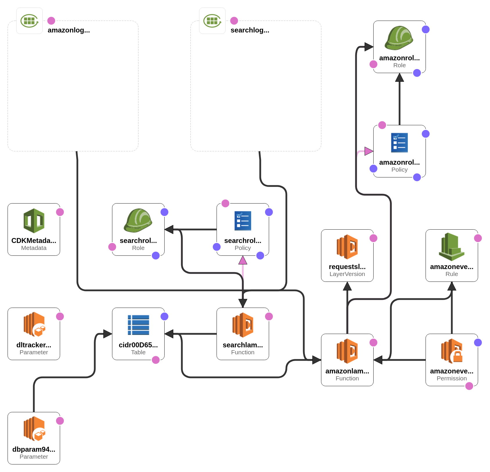

# distillery
Brewing up a delicious batch of CIDRs to search for a specific IPv4 or IPv6 that contains availability zones, region, and service details beyond traditional ASN and WHOIS network information.

https://docs.aws.amazon.com/general/latest/gr/aws-ip-ranges.html

